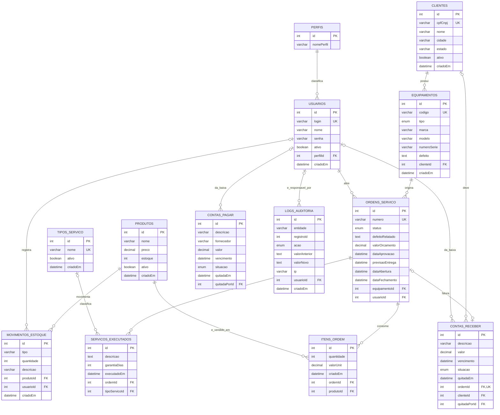

# DER — Diagrama Entidade-Relacionamento

**Sistema:** SGA TI — Sistema de Gerenciamento de Assistência Técnica
**Origem:** gerado a partir de `prisma/schema.prisma` e das quatro migrations em
`prisma/migrations/`, na `main` consolidada
**Data:** 05/10/2026
**SGBD:** MySQL 8 (`provider = "mysql"`)

> `[VALIDAR: confronto com a Figura 4 da monografia.]` O documento acadêmico não
> estava disponível quando este DER foi gerado. A seção 7 lista o que mudou com
> base na descrição do plano de trabalho, mas a comparação lado a lado com a
> figura atual ainda precisa ser feita.

---

## 1. Visão geral

O modelo tem **13 tabelas** e **4 enumerações**, organizadas em cinco blocos:

| Bloco | Tabelas | Módulos |
|---|---|---|
| Acesso | `perfis`, `usuarios` | 1 e 4 |
| Atendimento | `clientes`, `equipamentos`, `ordens_servico`, `servicos_executados`, `tipos_servico` | 1, 2, 3 e 5 |
| Estoque | `produtos`, `itens_ordem`, `movimentos_estoque` | 4 |
| Financeiro | `contas_pagar`, `contas_receber` | 4 |
| Rastreabilidade | `logs_auditoria` | NF005 |

O núcleo do sistema é a trilha **cliente → equipamento → ordem de serviço**. Tudo
o mais pendura nela: os serviços executados e as peças descrevem o que foi feito
na OS, e a conta a receber nasce do encerramento dela.

---

## 2. Diagrama

Para manter a figura legível em A4, o diagrama mostra a **chave primária, as
chaves estrangeiras, as chaves únicas e os atributos que definem cada entidade**.
A listagem completa de campos está na seção 5, uma tabela por entidade.

### 2.1 Figuras exportadas

| Arquivo | Conteúdo | Dimensões |
|---|---|---|
| `docs/der.png` | Diagrama completo, com os atributos | 5092 × 3958 px |
| `docs/der-visao-geral.png` | Só entidades e relacionamentos | 5802 × 2109 px |

Gerados com `@mermaid-js/mermaid-cli` 11 a partir do bloco acima, tema `neutral`,
fundo branco.

**Sobre a impressão em A4 retrato.** Vale ser direto: um DER de 13 entidades com
todos os atributos **não fica legível** numa página A4 retrato. O arquivo
`der.png` tem proporção 1,29; impresso na largura útil de 180 mm, ocupa 140 mm
de altura e o texto fica com cerca de **0,9 mm** — algo como
3 pontos, pequeno demais para leitura em papel. Aumentar a fonte não resolve,
porque as caixas crescem junto e a proporção não muda.

O encaminhamento honesto é usar as duas figuras com papéis diferentes:

- **`der-visao-geral.png` no corpo do texto.** Mostra as 13 entidades e os 15
  relacionamentos com os nomes legíveis, que é o que o leitor precisa para
  entender o modelo.
- **`der.png` como figura de página inteira**, preferencialmente em orientação
  paisagem ou em apêndice, para quem quiser conferir os atributos.
- **A seção 5 deste documento** é a referência de detalhe: lista campo a campo,
  com tipo, nulidade, chave e valor padrão. A figura não precisa ser lida
  atributo por atributo porque a tabela cumpre esse papel melhor.

`[VALIDAR: se a banca exigir o DER completo e legível em retrato, o caminho é
quebrar em quatro figuras, uma por bloco (acesso, atendimento, estoque e
financeiro). Dá quatro diagramas pequenos e confortáveis de ler. É só pedir.]`

---

## 3. Convenções

| Convenção | Adotada |
|---|---|
| Chave primária | `id INT AUTO_INCREMENT`, em todas as 12 tabelas |
| Nome da tabela | Plural e em `snake_case`, via `@@map` (`ordens_servico`, `itens_ordem`) |
| Nome da coluna | `camelCase`, como no modelo Prisma |
| Data de criação | `criadoEm DATETIME(3) DEFAULT CURRENT_TIMESTAMP(3)` |
| Exclusão lógica | Coluna `ativo BOOLEAN DEFAULT true`, onde existe (ver 8.3) |
| Valor monetário | `DECIMAL(10,2)` — nunca `FLOAT`, para não perder centavo em arredondamento |

---

## 4. Enumerações

### `StatusOS` — ciclo de vida da ordem de serviço

`INICIAL` → `ORCAMENTO` → `AUTORIZADO` → `EM_ANDAMENTO` → `FINALIZADO`, com
`CANCELADO` alcançável a partir dos estados intermediários. Padrão: `INICIAL`.

| Valor | Significado |
|---|---|
| `INICIAL` | OS aberta, equipamento recebido, ainda sem orçamento |
| `ORCAMENTO` | Orçamento lançado, aguardando resposta do cliente |
| `AUTORIZADO` | Cliente aprovou; o serviço pode começar |
| `EM_ANDAMENTO` | Pelo menos um serviço já foi registrado |
| `CANCELADO` | Orçamento recusado ou desistência |
| `FINALIZADO` | Serviço concluído e faturado |

### `SituacaoConta` — contas a pagar e a receber

`ABERTA` (padrão), `PAGA`, `CANCELADA`.

### `TipoEquipamento` — classificação do equipamento

`NOTEBOOK`, `DESKTOP`, `IMPRESSORA`, `SERVIDOR`, `CELULAR`, `OUTRO` (padrão).

Criada no Módulo 5 para atender ao RF019, que pede relatório "por tipo de
equipamento". Antes só existiam marca e modelo, e o banco não tinha como saber
que "Dell Inspiron" e "Dell PowerEdge" são um notebook e um servidor.

### `AcaoAuditoria` — tipo de operação registrada no log

`LEITURA`, `INCLUSAO`, `ALTERACAO`, `EXCLUSAO`.

Criada no NF005. O registro automático cobre só as operações de escrita;
`LEITURA` existe no catálogo porque o requisito a prevê, mas logar toda consulta
multiplicaria o volume sem acrescentar rastreabilidade de quem alterou o quê.

---

## 5. Entidades

### 5.1 `perfis` (`Perfil`)

**Papel:** catálogo dos seis níveis de acesso do sistema. É o que o
`perfilMiddleware` consulta para autorizar cada rota (RF022/RF023).

| Campo | Tipo | Nulo | Chave | Padrão |
|---|---|---|---|---|
| `id` | `INT` | não | PK | auto |
| `nomePerfil` | `VARCHAR(50)` | não | — | — |

Valores em uso: `ADMINISTRADOR`, `ATENDENTE`, `TECNICO`, `VENDEDOR`,
`FINANCEIRO`, `COMPRAS`.

> **Observação:** `nomePerfil` **não** é único no banco (ver 8.1).

### 5.2 `usuarios` (`Usuario`)

**Papel:** quem opera o sistema. Autentica por sessão nas telas e por JWT na API,
e carrega o perfil que define o que pode fazer.

| Campo | Tipo | Nulo | Chave | Padrão |
|---|---|---|---|---|
| `id` | `INT` | não | PK | auto |
| `nome` | `VARCHAR(150)` | não | — | — |
| `login` | `VARCHAR(100)` | não | UK | — |
| `senha` | `VARCHAR(255)` | não | — | — |
| `ativo` | `BOOLEAN` | não | — | `true` |
| `perfilId` | `INT` | não | FK → `perfis.id` | — |
| `criadoEm` | `DATETIME(3)` | não | — | agora |

`senha` guarda o hash bcrypt, nunca o texto. O tamanho 255 acomoda o hash de 60
caracteres com folga.

### 5.3 `clientes` (`Cliente`)

**Papel:** pessoa física ou jurídica dona dos equipamentos. Concentra os dados
pessoais do sistema — é a tabela crítica para a LGPD (NF008).

| Campo | Tipo | Nulo | Chave | Padrão |
|---|---|---|---|---|
| `id` | `INT` | não | PK | auto |
| `nome` | `VARCHAR(150)` | não | — | — |
| `cpfCnpj` | `VARCHAR(18)` | não | UK | — |
| `rg` | `VARCHAR(20)` | sim | — | — |
| `dataNascimento` | `DATETIME(3)` | sim | — | — |
| `endereco` | `VARCHAR(200)` | sim | — | — |
| `numero` | `VARCHAR(10)` | sim | — | — |
| `bairro` | `VARCHAR(100)` | sim | — | — |
| `cidade` | `VARCHAR(100)` | sim | — | — |
| `estado` | `CHAR(2)` | sim | — | — |
| `cep` | `VARCHAR(9)` | sim | — | — |
| `telefone` | `VARCHAR(20)` | sim | — | — |
| `celular` | `VARCHAR(20)` | sim | — | — |
| `email` | `VARCHAR(150)` | sim | — | — |
| `ativo` | `BOOLEAN` | não | — | `true` |
| `criadoEm` | `DATETIME(3)` | não | — | agora |

`cpfCnpj` com 18 posições acomoda o CNPJ formatado (`00.000.000/0000-00`).
`cidade` e `estado` são os campos que sustentariam o NF004 (análise geográfica),
hoje sem relatório que os use.

### 5.4 `equipamentos` (`Equipamento`)

**Papel:** a máquina que entra na assistência. Pertence a um cliente e pode voltar
várias vezes — é por isso que o histórico por equipamento (RF012) faz sentido.

| Campo | Tipo | Nulo | Chave | Padrão |
|---|---|---|---|---|
| `id` | `INT` | não | PK | auto |
| `codigo` | `VARCHAR(50)` | não | UK | — |
| `tipo` | `ENUM TipoEquipamento` | não | — | `OUTRO` |
| `marca` | `VARCHAR(100)` | não | — | — |
| `modelo` | `VARCHAR(100)` | não | — | — |
| `numeroSerie` | `VARCHAR(100)` | sim | — | — |
| `defeito` | `TEXT` | não | — | — |
| `clienteId` | `INT` | não | FK → `clientes.id` | — |
| `criadoEm` | `DATETIME(3)` | não | — | agora |

`defeito` é o defeito do cadastro, relatado na entrada do equipamento. Não
confundir com `ordens_servico.defeitoRelatado`, que é o defeito daquele
atendimento específico.

### 5.5 `ordens_servico` (`OrdemServico`)

**Papel:** a entidade central. Um atendimento, do recebimento ao faturamento.
Guarda o orçamento e as datas do ciclo.

| Campo | Tipo | Nulo | Chave | Padrão |
|---|---|---|---|---|
| `id` | `INT` | não | PK | auto |
| `numero` | `VARCHAR(20)` | não | UK | — |
| `status` | `ENUM StatusOS` | não | — | `INICIAL` |
| `defeitoRelatado` | `TEXT` | não | — | — |
| `observacoes` | `TEXT` | sim | — | — |
| `valorOrcamento` | `DECIMAL(10,2)` | sim | — | — |
| `dataAprovacao` | `DATETIME(3)` | sim | — | — |
| `previsaoEntrega` | `DATETIME(3)` | sim | — | — |
| `dataAbertura` | `DATETIME(3)` | não | — | agora |
| `dataFechamento` | `DATETIME(3)` | sim | — | — |
| `equipamentoId` | `INT` | não | FK → `equipamentos.id` | — |
| `usuarioId` | `INT` | não | FK → `usuarios.id` | — |

`numero` é o identificador que o cliente usa na consulta pública, e por isso é
único e separado do `id`. `usuarioId` é quem **abriu** a OS — não quem executou o
serviço (ver 8.2).

### 5.6 `servicos_executados` (`ServicoExecutado`)

**Papel:** o que o técnico efetivamente fez, com a garantia daquele serviço.

| Campo | Tipo | Nulo | Chave | Padrão |
|---|---|---|---|---|
| `id` | `INT` | não | PK | auto |
| `descricao` | `TEXT` | não | — | — |
| `observacoes` | `TEXT` | sim | — | — |
| `garantiaDias` | `INT` | sim | — | — |
| `executadoEm` | `DATETIME(3)` | não | — | agora |
| `ordemId` | `INT` | não | FK → `ordens_servico.id` | — |
| `tipoServicoId` | `INT` | sim | FK → `tipos_servico.id` | — |

**A data-fim da garantia não existe no banco.** É derivada de
`executadoEm + garantiaDias` em tempo de consulta. Persistir a data seria
duplicar informação que pode divergir; derivar garante que as duas telas que
mostram garantia nunca discordem.

`tipoServicoId` é opcional de propósito: os serviços registrados antes do
catálogo existir não têm tipo, e inventar um falsearia o relatório — eles
aparecem como "Não classificado".

### 5.7 `tipos_servico` (`TipoServico`)

**Papel:** catálogo de serviços. Existe para dar granularidade ao RF017.

| Campo | Tipo | Nulo | Chave | Padrão |
|---|---|---|---|---|
| `id` | `INT` | não | PK | auto |
| `nome` | `VARCHAR(120)` | não | UK | — |
| `ativo` | `BOOLEAN` | não | — | `true` |
| `criadoEm` | `DATETIME(3)` | não | — | agora |

Sem esta tabela, agrupar serviços por `descricao` (texto livre) geraria um grupo
por serviço: "Troca de tela", "troca da tela" e "Substituição da tela" contariam
como três serviços distintos.

### 5.8 `produtos` (`Produto`)

**Papel:** peça ou insumo usado nos consertos, com saldo de estoque.

| Campo | Tipo | Nulo | Chave | Padrão |
|---|---|---|---|---|
| `id` | `INT` | não | PK | auto |
| `nome` | `VARCHAR(150)` | não | — | — |
| `descricao` | `TEXT` | sim | — | — |
| `preco` | `DECIMAL(10,2)` | não | — | — |
| `estoque` | `INT` | não | — | `0` |
| `ativo` | `BOOLEAN` | não | — | `true` |
| `criadoEm` | `DATETIME(3)` | não | — | agora |

`estoque` é saldo materializado, mantido em transação junto com o lançamento em
`movimentos_estoque`. **Pode ficar negativo**, por decisão de projeto: travar a
saída pararia o atendimento no balcão, e o saldo negativo vira a fila de
regularização do setor de Compras.

### 5.9 `itens_ordem` (`ItemOrdem`)

**Papel:** peça lançada numa OS. É a tabela associativa entre `ordens_servico` e
`produtos`, mas com atributos próprios, então é entidade, não só ligação.

| Campo | Tipo | Nulo | Chave | Padrão |
|---|---|---|---|---|
| `id` | `INT` | não | PK | auto |
| `quantidade` | `INT` | não | — | — |
| `valorUnit` | `DECIMAL(10,2)` | não | — | — |
| `criadoEm` | `DATETIME(3)` | não | — | agora |
| `ordemId` | `INT` | não | FK → `ordens_servico.id` | — |
| `produtoId` | `INT` | não | FK → `produtos.id` | — |

`valorUnit` é o valor **negociado naquele lançamento**, copiado do produto no
momento do lançamento e não lido por referência: se o preço de tabela mudar
depois, a OS antiga tem que continuar valendo o que foi cobrado.

`criadoEm` entrou no Módulo 5 porque o RF018 precisa da data da venda da peça.
Sem ela, uma OS aberta em julho com peça lançada em agosto contaria como julho.

### 5.10 `movimentos_estoque` (`MovimentoEstoque`)

**Papel:** razão do estoque. Cada entrada ou saída vira uma linha, e a soma tem
que fechar com `produtos.estoque`.

| Campo | Tipo | Nulo | Chave | Padrão |
|---|---|---|---|---|
| `id` | `INT` | não | PK | auto |
| `tipo` | `VARCHAR(10)` | não | — | — |
| `quantidade` | `INT` | não | — | — |
| `descricao` | `VARCHAR(200)` | sim | — | — |
| `produtoId` | `INT` | não | FK → `produtos.id` | — |
| `usuarioId` | `INT` | sim | FK → `usuarios.id` | — |
| `criadoEm` | `DATETIME(3)` | não | — | agora |

`tipo` aceita `ENTRADA` e `SAIDA`. É `VARCHAR`, não enum — ver 8.1.

### 5.11 `contas_pagar` (`ContaPagar`)

**Papel:** obrigação da empresa com fornecedores (RF020). Tabela independente:
não tem vínculo com produto nem com OS.

| Campo | Tipo | Nulo | Chave | Padrão |
|---|---|---|---|---|
| `id` | `INT` | não | PK | auto |
| `descricao` | `VARCHAR(200)` | não | — | — |
| `fornecedor` | `VARCHAR(150)` | sim | — | — |
| `valor` | `DECIMAL(10,2)` | não | — | — |
| `vencimento` | `DATETIME(3)` | não | — | — |
| `situacao` | `ENUM SituacaoConta` | não | — | `ABERTA` |
| `quitadaEm` | `DATETIME(3)` | sim | — | — |
| `observacoes` | `TEXT` | sim | — | — |
| `quitadaPorId` | `INT` | sim | FK → `usuarios.id` | — |
| `criadoEm` | `DATETIME(3)` | não | — | agora |

### 5.12 `contas_receber` (`ContaReceber`)

**Papel:** direito a receber do cliente (RF021). É a ponte entre o atendimento e
o financeiro: ao encerrar a OS, a conta é gerada na mesma transação.

| Campo | Tipo | Nulo | Chave | Padrão |
|---|---|---|---|---|
| `id` | `INT` | não | PK | auto |
| `descricao` | `VARCHAR(200)` | não | — | — |
| `valor` | `DECIMAL(10,2)` | não | — | — |
| `vencimento` | `DATETIME(3)` | não | — | — |
| `situacao` | `ENUM SituacaoConta` | não | — | `ABERTA` |
| `quitadaEm` | `DATETIME(3)` | sim | — | — |
| `observacoes` | `TEXT` | sim | — | — |
| `ordemId` | `INT` | sim | FK → `ordens_servico.id`, **UK** | — |
| `clienteId` | `INT` | sim | FK → `clientes.id` | — |
| `quitadaPorId` | `INT` | sim | FK → `usuarios.id` | — |
| `criadoEm` | `DATETIME(3)` | não | — | agora |

`ordemId` é **único**, o que torna a relação com a OS um **1:1 opcional**: uma OS
gera no máximo uma conta, e a restrição está no banco, não só no código. Opcional
porque o financeiro também lança contas avulsas, sem OS.

### 5.13 `logs_auditoria` (`LogAuditoria`)

**Papel:** rastreabilidade (NF005). Registra quem alterou o quê, quando e de
qual IP. É a única tabela que nenhuma tela escreve: a gravação é feita por uma
extensão do Prisma Client, e não existe rota de escrita.

| Campo | Tipo | Nulo | Chave | Padrão |
|---|---|---|---|---|
| `id` | `INT` | não | PK | auto |
| `entidade` | `VARCHAR(60)` | não | — | — |
| `registroId` | `INT` | sim | — | — |
| `acao` | `ENUM AcaoAuditoria` | não | — | — |
| `valorAnterior` | `TEXT` | sim | — | — |
| `valorNovo` | `TEXT` | sim | — | — |
| `ip` | `VARCHAR(45)` | sim | — | — |
| `usuarioId` | `INT` | sim | FK → `usuarios.id` | — |
| `criadoEm` | `DATETIME(3)` | não | — | agora |

Índices em `criadoEm`, `(entidade, registroId)` e `usuarioId` — os três caminhos
de consulta da tela. `registroId` é nulo quando a operação não atinge um registro
único; `usuarioId` é nulo nas operações sem sessão, como o seed. Detalhes em
`docs/AUDITORIA.md`.

---

## 6. Relacionamentos e cardinalidades

| # | Origem | Destino | Cardinalidade | Coluna | `ON DELETE` |
|---|---|---|---|---|---|
| R01 | `perfis` | `usuarios` | 1 : 0..N | `usuarios.perfilId` | `RESTRICT` |
| R02 | `clientes` | `equipamentos` | 1 : 0..N | `equipamentos.clienteId` | `RESTRICT` |
| R03 | `equipamentos` | `ordens_servico` | 1 : 0..N | `ordens_servico.equipamentoId` | `RESTRICT` |
| R04 | `usuarios` | `ordens_servico` | 1 : 0..N | `ordens_servico.usuarioId` | `RESTRICT` |
| R05 | `ordens_servico` | `servicos_executados` | 1 : 0..N | `servicos_executados.ordemId` | `RESTRICT` |
| R06 | `tipos_servico` | `servicos_executados` | 0..1 : 0..N | `servicos_executados.tipoServicoId` | `SET NULL` |
| R07 | `ordens_servico` | `itens_ordem` | 1 : 0..N | `itens_ordem.ordemId` | `RESTRICT` |
| R08 | `produtos` | `itens_ordem` | 1 : 0..N | `itens_ordem.produtoId` | `RESTRICT` |
| R09 | `produtos` | `movimentos_estoque` | 1 : 0..N | `movimentos_estoque.produtoId` | `RESTRICT` |
| R10 | `usuarios` | `movimentos_estoque` | 0..1 : 0..N | `movimentos_estoque.usuarioId` | `SET NULL` |
| R11 | `ordens_servico` | `contas_receber` | 0..1 : 0..1 | `contas_receber.ordemId` (UK) | `SET NULL` |
| R12 | `clientes` | `contas_receber` | 0..1 : 0..N | `contas_receber.clienteId` | `SET NULL` |
| R13 | `usuarios` | `contas_receber` | 0..1 : 0..N | `contas_receber.quitadaPorId` | `SET NULL` |
| R14 | `usuarios` | `contas_pagar` | 0..1 : 0..N | `contas_pagar.quitadaPorId` | `SET NULL` |
| R15 | `usuarios` | `logs_auditoria` | 0..1 : 0..N | `logs_auditoria.usuarioId` | `SET NULL` |

**Leitura das ações de exclusão.** A regra que o Prisma gerou é coerente e vale
explicar na defesa:

- **`RESTRICT`** nas relações obrigatórias. O banco **impede** apagar um cliente
  que tem equipamento, um equipamento que tem OS, um produto que foi vendido. É o
  que protege o histórico — e é por isso que a exclusão de cliente (RF004, só
  administrador) é lógica, via `ativo = false`, e não física.
- **`SET NULL`** nas relações opcionais de autoria e classificação. Desativar um
  tipo de serviço ou remover um usuário não pode apagar o histórico financeiro
  nem o serviço executado: o vínculo se perde, o registro permanece.
- `ON UPDATE CASCADE` em todas, o padrão do Prisma. Sem efeito prático aqui,
  porque nenhuma PK é atualizada.

---

## 7. O que mudou em relação ao DER do documento (Figura 4)

`[VALIDAR: confirmar contra a figura atual quando a monografia estiver
disponível.]` A lista abaixo parte da descrição do plano de trabalho.

| # | Mudança | Por quê |
|---|---|---|
| 1 | **`Produto_Utilizado` virou `ItemOrdem`** (tabela `itens_ordem`) | Renomeada no Módulo 4. O nome antigo sugeria consumo; a entidade guarda quantidade e valor negociado, que é um item de venda |
| 2 | **`TipoServico` é nova** | Módulo 5, RF017. Sem catálogo, agrupar por descrição livre dava um grupo por serviço |
| 3 | **`MovimentoEstoque` é nova** | Módulo 4, RF015. O saldo sozinho não conta a história; o razão permite conferir entrada por entrada |
| 4 | **`ContaPagar` e `ContaReceber` são novas** | Módulo 4, RF020 e RF021 |
| 5 | **Enum `StatusOS`** | Formaliza o ciclo da OS, que antes seria texto livre |
| 6 | **Enum `SituacaoConta`** | Módulo 4, junto com o financeiro |
| 7 | **Enum `TipoEquipamento`** | Módulo 5, RF019 |
| 8 | **`Equipamento.tipo` é novo** | Mesmo motivo do item 7 |
| 9 | **`ItemOrdem.criadoEm` é novo** | Módulo 5, RF018: a peça precisa de data própria |
| 10 | **`Cliente.bairro` é novo** | Módulo 4, defeito P10: a edição de cliente quebrava sem ele |
| 11 | **`MovimentoEstoque.usuarioId` e `*.quitadaPorId` são novos** | Módulo 4 V03, rastreabilidade de quem movimentou e de quem deu baixa |

---

## 8. Observações de modelagem

Pontos verificados no schema que merecem decisão. Nenhum impede a entrega.

### 8.1 Inconsistências de tipo e restrição

| # | Ponto | Situação | Recomendação |
|---|---|---|---|
| M01 | `perfis.nomePerfil` **não é único** | O banco aceita dois perfis `ADMINISTRADOR`. O `prisma/seed.js` se protege com `findFirst` antes de criar, mas nada impede a duplicata por outro caminho. Com perfil duplicado, parte dos usuários aponta para um e parte para outro, e o controle de acesso fica imprevisível | Acrescentar `@unique`. É uma migration de uma linha |
| M02 | `movimentos_estoque.tipo` é `VARCHAR(10)`, não enum | As outras três classificações fechadas do sistema (`StatusOS`, `SituacaoConta`, `TipoEquipamento`) são enum. Esta aceita qualquer string de 10 caracteres; a validação existe só no service | Converter para `enum TipoMovimento { ENTRADA, SAIDA }`, por coerência |
| M03 | `produtos.nome` não é único | Dois produtos com o mesmo nome convivem | Provavelmente **correto** — duas peças iguais de fornecedores diferentes são produtos distintos. Registrar a decisão |
| M04 | `perfis` não tem `ativo` nem `criadoEm` | É a única tabela sem data de criação | Baixa prioridade: o catálogo é fixo, criado pelo seed |

### 8.2 Relacionamentos que o documento sugere e o modelo não tem

| # | Ausência | Consequência | Origem |
|---|---|---|---|
| M05 | `ServicoExecutado` **não tem `usuarioId`** | Não se sabe qual técnico executou cada serviço. `ordens_servico.usuarioId` é quem *abriu* a OS, que em geral é o atendente, não o técnico | Pendência P04 do Módulo 3 |
| M06 | Não há vínculo entre `ServicoExecutado` e `ItemOrdem` | Não dá para dizer qual peça foi usada em qual serviço, só que ambos pertencem à mesma OS | Pendência P02 do Módulo 3 |
| M07 | `ContaPagar` não se liga a `MovimentoEstoque` | A conta gerada na entrada de estoque não aponta para o movimento que a originou | Módulo 4 |
| M08 | ~~Não existe `LogAuditoria`~~ | **Resolvido** — tabela `logs_auditoria`, ver 5.13 e `docs/AUDITORIA.md` | — |

Com o M08 resolvido, o M05 ficou parcialmente coberto: o log registra qual usuário
criou cada serviço executado. Ainda assim, um `usuarioId` direto em
`servicos_executados` continua sendo o modelo correto — quem executou o serviço é
informação do negócio, que aparece em relatório e em garantia, não um dado de
log.

### 8.3 Exclusão lógica incompleta

Só **4 das 13** tabelas têm coluna `ativo`: `usuarios`, `clientes`,
`tipos_servico` e `produtos`.

Não têm: `perfis`, `equipamentos`, `ordens_servico`, `servicos_executados`,
`itens_ordem`, `movimentos_estoque`, `contas_pagar`, `contas_receber` e
`logs_auditoria`.

Para a maioria isso é correto — OS, serviço, item, movimento e conta são registros
históricos que não se apagam, e o `RESTRICT` das FKs já impede a exclusão física.
Em `logs_auditoria` é obrigatório que seja assim: log que se apaga não prova nada.
A exceção é **`equipamentos`**: um equipamento cadastrado por engano, ou que o
cliente não traz mais, não tem como sair da lista. É o item a revisar no NF008
(Fase 5).
